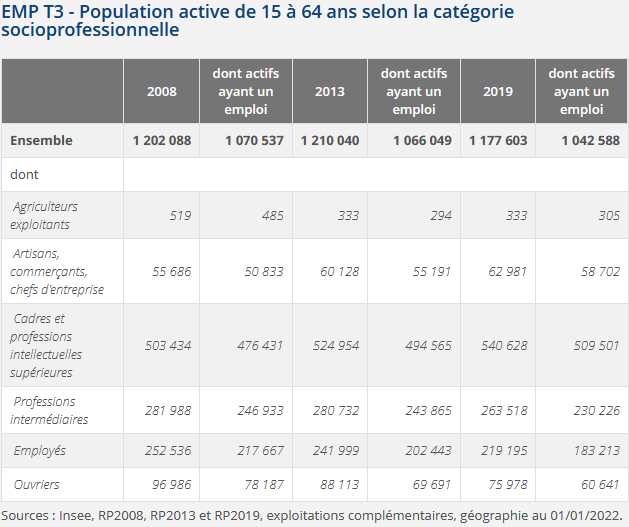
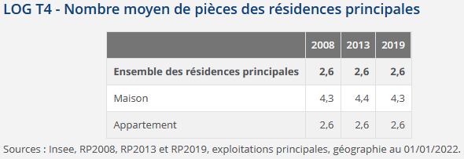

# (PART\*) Séance 2 : Data Mining - Analyse descriptive {-}


# Quelles questions intéressantes pour une "fouille de données" sur cette base ? {#c05-Questions-fouille-donnees}

<div align="justify">

Quelles sont les questions intéressantes que l'on peut se poser ? Qu'est-ce qu'on va pouvoir mettre en évidence à partir de ces données ?  

D'abord, on peut caractériser la population de Paris et sa petite couronne selon des variables socio-démographiques (sexe, âge, diplôme, statut conjugal, nombre d'enfants, ...) et d'emploi (statut d'activité, PCS, condition d'emploi - contrat, temps de travail -, secteur d'activité, ...). Ensuite, on peut décrire les logements de Paris et sa petite couronne, selon le type (appartement, maison, HLM, ...), la superficie, le nombre de pièces, le nombre de personnes y habitant, le statut d'occupation (propriétaire, locataire, ...), l'ancienneté d'occupation. Enifn, on peut décrire plus précisément les pièces du logement en termes de confort (baignoire / douche, salle climatisée, moyen de chauffage), ainsi que les parties communes de l'immeuble (ascenseur, place de stationnement). Enfin, on pourrait étudier les caractéristiques des occupants de ces logements, et en premier lieu ici ce que l'Insee appelle la "personne de référence du ménage". Par ailleurs, toutes ces analyses peuvent être réalisées en comparant les différentes communes de Paris et sa petite couronne, ou à un niveau géographique plus fin par quartiers, arrondissements ou encore IRIS.   

Pour manipuler cette base et répondre à quelques-unes de ces questions, nous allons nous concentrer sur la commune de Paris, et allons chercher à reproduire des statistiques publiées sur le site de l'Insee. Nous produirons principalement, lors de cette séance, des tableaux de statistiques, l'analyse graphique fera en effet l'objet de la séance suivante car elle nécessite la présentation détaillée de la "grammaire" **`Ggplot`**.  
  
Avant cela, si les tables de données ("RP_final" et "meta") ne sont plus dans votre environnement local, il faut de nouveau les importer à partir de l'enregistrement précédemment effectué dans le dossier 'data' de votre projet. Pour cela, il faut utiliser la fonction `readRDS()`, comme ci-dessous :
```{r eval=FALSE, include=FALSE}
RP_final <- readRDS(file = "data/RP_final.Rdata")
meta <- readRDS(file = "data/meta.Rdata")
```
  

## Caractéristiques de la population de Paris 
Sur le site de l'Insee, vous pouvez trouver les statistiques générales sur les individus à Paris en 2019 <a href="https://www.insee.fr/fr/statistiques/6455183?sommaire=6455209&geo=DEP-75" target="_blank">ici</a> et <a href="https://www.insee.fr/fr/statistiques/6455302?sommaire=6455322&geo=DEP-75" target="_blank">là</a>.  

Comme déjà vu lors de la 1ère séance, l'application de la pondération pour avoir des statistiques représentatives de la population peut être utilisée à l'intérieur de la fonction `count()` avec l'argument `wt=`. Cela nous donnera le nombre d'individus concernés par la caractéristique étudiée (par défaut, la variable créée s'appelle "n", on peut la renommer dans une étape ultérieure avec la fonction `rename()`). Souvent, on souhaite aussi avoir les pourcentages, on peut alors créer une variable rapportant le nombre de chaque catégorie sur le nombre total d'individus, avec la fonction `prop.table()` utilisée dans la fonction `mutate()`. Le package **`janitor`** peut permettre enfin d'ajouter une ligne totale (ou une colonne totale selon ce qu'on souhaite faire) avec la fonction `adorn_totals()`, argument "row" pour avoir le total en ligne ou "col" pour l'avoir en colonne.Des fonctions supplémentaires liées au package **`gt()`** peuvent ensuite être utilisées pour mettre en forme le tableau : `fmt_number()`, `tab_header()` ou encore `tab_source_note()`.      
 
A partir de ces indications, afficher le tableau suivant à partir d'un code utilisant le langage **tidyverse** et en une seule procédure (sans créer de table dans votre environnement) :
 
```{r echo=FALSE}
library(tidyverse)
library(janitor)
library(gt)
RP_final %>% 
  filter(DEPT == "75") %>% 
  mutate(SEXE_moda=case_when(SEXE=="1" ~ "Hommes", SEXE=="2" ~ "Femmes")) %>% 
  count(SEXE_moda, wt=IPONDI) %>% 
  mutate(Pourcentage=round(prop.table(n)*100, 1)) %>% 
  adorn_totals("row") %>% 
  rename(Effectif=n, 'Sexe'=SEXE_moda) %>% 
  gt() %>% 
  fmt_number(columns = 2, sep_mark = " ", decimals = 0) %>% 
  tab_header(title = "Population par sexe en 2019") %>% 
  tab_source_note(source_note = "Source : Insee, RP 2019 ; Champ : Paris.")
```
 
 <div class="solution-exo">
```{r message=FALSE, eval=FALSE}
library(tidyverse)
library(janitor)
library(gt)
RP_final %>% 
  filter(DEPT == "75") %>% 
  mutate(SEXE_moda=case_when(SEXE=="1" ~ "Hommes", SEXE=="2" ~ "Femmes")) %>% 
  count(SEXE_moda, wt=IPONDI) %>% 
  mutate(Pourcentage=round(prop.table(n)*100, 1)) %>% 
  adorn_totals("row") %>% 
  rename(Effectif=n, 'Sexe'=SEXE_moda) %>% 
  gt() %>% 
  fmt_number(columns = 2, sep_mark = " ", decimals = 0) %>% 
  tab_source_note(source_note = "Source : Insee, RP 2019 ; Champ : Paris.") %>% 
  tab_header(title = "Population par sexe en 2019")
```
</div>
\fi
Il y a plus de femmes habitant Paris en 2019, environ 53%.     


Cherchons maintenant la répartition de la population parisienne par type d'activité : quelle est la proportion d'actifs ayant un emploi par rapport à la part des chômeurs ou encore des retraites ? Attention au champ sur lequel porte ces statistiques (lire le titre du tableau pour cela...).    
 
```{r echo=FALSE}
RP_final %>% 
  filter(DEPT == "75" & !AGEREVQ %in% c("0", "5", "10", "65", "70", "75", "80", "85", "90", "95", 
                                        "100", "105", "110", "115", "120")) %>% 
  mutate(TACT_moda1=case_when(TACT == "11" ~ "Actifs ayant un emploi",
                             TACT == "12" ~ "Chômeurs",
                             TACT == "22" ~ "Élèves, étudiants et stagiaires non rémunérés",
                             TACT == "21" ~ "Retraités ou préretraités",
                             TRUE ~ "Autres inactifs"),
         TACT_moda1=fct_relevel(TACT_moda1, c("Actifs ayant un emploi", "Chômeurs",
                                            "Élèves, étudiants et stagiaires non rémunérés", 
                                            "Retraités ou préretraités", "Autres inactifs"))) %>% 
  count(TACT_moda1, wt=IPONDI) %>% 
  mutate(Pourcentage=round(prop.table(n)*100,1)) %>% 
  adorn_totals("row") %>% 
  rename(Effectif=n, "Type d'activité"=TACT_moda1) %>% 
  gt() %>% 
  fmt_number(columns = 2, sep_mark = " ", decimals = 0) %>% 
  tab_header(title = "Population de 15-64 ans par type d'activité en 2019") %>% 
  tab_source_note(source_note = "Source : Insee, RP 2019 ; Champ : Paris.")
```
 
 <div class="solution-exo">
```{r message=FALSE, eval=FALSE}
RP_final %>% 
  filter(DEPT == "75" & !AGEREVQ %in% c("0", "5", "10", "65", "70", "75", "80", "85", "90", "95", 
                                        "100", "105", "110", "115", "120")) %>% 
  mutate(TACT_moda1=case_when(TACT == "11" ~ "Actifs ayant un emploi",
                             TACT == "12" ~ "Chômeurs",
                             TACT == "22" ~ "Élèves, étudiants et stagiaires non rémunérés",
                             TACT == "21" ~ "Retraités ou préretraités",
                             TRUE ~ "Autres inactifs"),
         TACT_moda1=fct_relevel(TACT_moda1, c("Actifs ayant un emploi", "Chômeurs",
                                            "Élèves, étudiants et stagiaires non rémunérés", 
                                            "Retraités ou préretraités", "Autres inactifs"))) %>% 
  count(TACT_moda1, wt=IPONDI) %>% 
  mutate(Pourcentage=round(prop.table(n)*100,1)) %>% 
  adorn_totals("row") %>% 
  rename(Effectif=n, "Type d'activité"=TACT_moda1) %>% 
  gt() %>% 
  fmt_number(columns = 2, sep_mark = " ", decimals = 0) %>% 
  tab_header(title = "Population de 15-64 ans par type d'activité en 2019") %>% 
  tab_source_note(source_note = "Source : Insee, RP 2019 ; Champ : Paris.")
```
</div>
\fi
En 2019, la population parisienne comportait plus de 78% d'actifs dont 69% ayant un emploi et 9% au chômage, le taux de chômage à Paris était donc de 11,5% (135014/(1042588+135014))*100). La part des étudiants ou autres élèves était plus élevée que celle des retraités (ou préretaités) : 12,8% contre 2,6%.    
   
  
Maintenant, affichons les deux dernières colonnes ('2019' et 'dont actifs ayant un emploi') de ce tableau tiré du site de l'Insee, en mettant la ligne "Ensemble" plutôt en fin de tableau (ces 2 usages sont possibles, question de préférence...). Attention encore une fois au champ de ce tableau... Pour cela, on va : 

- récupérer les libellés des modalités de la variable cS1 à partir du fichier 'meta', en créant 2 vecteurs correspondant aux modalités pour le 1er et aux libellés pour le 2nd, puis en créant une variable 'CS1_moda' à partir de ces vecteurs ;
- créer une 1ère table qu'on appellera 'col2' qui comportera la 1ère colonne avec les intitulés des PCS et la colonne '2019', attention, il y a une modalité qui ne nous intéresse pas car non affiché dans le tableau de l'Insee, il faudra supprimer cette ligne (vous pouvez utiliser pour cela la fonction `slice()`) ; 
- créer une 2ème table qu'on appellera 'col3' qui comportera la 1ère colonne avec les intitulés des PCS et la colonne 'dont actifs ayant un emploi', attention le champ n'est donc pas tout à fait le même ;
- joindre ces deux tables et appliquer les fonctions `gt()` et suivantes pour la mise en forme du tableau final.


 <div class="solution-exo">
```{r eval=FALSE, message=FALSE}
# On va récupérer les libellés des modalités de la variable CS1 à partir du fichier meta :
levels_CS1 <- meta[meta$COD_VAR=="CS1", ]$COD_MOD
labels_CS1 <- meta[meta$COD_VAR=="CS1", ]$LIB_MOD
RP_final <- RP_final %>% mutate(CS1_moda=factor(CS1, levels = levels_CS1, labels = labels_CS1))

col2 <- RP_final %>% 
  filter(DEPT == "75" & !AGEREVQ %in% c("0", "5", "10", "65", "70", "75", "80", "85", 
                                        "90", "95", "100", "105", "110", "115", "120") &
           TACT %in% c("11", "12")) %>% 
  count(CS1_moda, wt=IPONDI) %>% 
  mutate(n=round(n)) %>% 
  rename('2019'=n, 'PCS'=CS1_moda) %>% 
  adorn_totals("row") %>% 
  slice(-7)

col3 <- RP_final %>% 
  filter(DEPT == "75" & !AGEREVQ %in% c("0", "5", "10", "65", "70", "75", "80", "85",
                                        "90", "95", "100", "105", "110", "115", "120") &
           TACT %in% c("11")) %>% 
  count(CS1_moda, wt=IPONDI) %>% 
  mutate(n=round(n)) %>% 
  rename('dont actifs ayant un emploi'=n, 'PCS'=CS1_moda) %>% 
  adorn_totals("row")

col2 %>% left_join(col3) %>%  
  gt()  %>% 
  fmt_number(columns = c(2,3), sep_mark = " ", decimals = 0) %>% 
  tab_header(title = "Population active de 15-64 ans selon la 
             catégorie socioprofessionnelle en 2019") %>% 
  tab_source_note(source_note = "Source : Insee, RP 2019 ; Champ : Paris.")

# On supprime les tableaux intermédiaires
rm(col2, col3)
```
</div>
\fi

A Paris, la population active comprend en 2019 plus de 500 000 personnes appartenant à la catégorie "cadres et professions intellectuelles supérieures", des 2 colonnes on peut en déduire qu'il y a environ 31 000 personnes relevant de cette PCS qui sont au chômage. Les cadres sont suivis des professions intermédiaires (plus de 260 000 actifs) et des employés (quasi 220 000). Il y a très peu d'agriculteurs exploitants, ce qui semble assez logique sur le territoire de Paris !   
    
  

Enfin, pour donner un exemple sur l'étude des caractéristiques des logements, essayons de même de reproduire le tableau de l'Insee ci-dessous. Souvenez-vous que cette base a plusieurs unités statistiques/niveaux : individus, logements/ménages, etc. Il faut donc faire attention : 

- au champ du tableau donc les filtres à utiliser ici ;
- à avoir d'abord les moyennes sur ces deux types de logements, donc uiliser à la suite les fonctions `group_by()` et `summarise()` ;
- à ajouter ensuite une ligne sur l'ensemble des résidences principales avec la fonction `bind_rows()` ; 
- à changer les dénominations des colonnes et des modalités, avec les fonctions du package `gt()` comme `cols_label()` ou `text_case_match()`.



<div class="solution-exo">
```{r eval=FALSE, warning=FALSE}
RP_final %>% 
  filter(DEPT == "75" & LPRM=="1" & CATL=="1" & TYPL %in% c("1", "2")) %>% 
  group_by(TYPL) %>%
  summarise(Moy_pieces = weighted.mean(as.numeric(as.character(NBPI)), IPONDI, na.rm=T)) %>%
  bind_rows(summarise(TYPL = "Ensemble des résidences principales", 
                      RP_final[RP_final$DEPT == "75" & RP_final$LPRM=="1" & 
                                 RP_final$CATL == "1" & RP_final$TYPL %in% c("1", "2"), ], 
                      Moy_pieces = weighted.mean(as.numeric(as.character(NBPI)), IPONDI, na.rm=T))) %>%
  gt() %>% 
  fmt_number(columns = 2, dec_mark = ",", decimals = 1) %>% 
  cols_label(TYPL="Type de logement", Moy_pieces="2019") %>% 
  text_case_match("1" ~ "Maison", "2" ~ ("Appartements")) %>% 
  tab_header(title = "Nombre moyen de pièces des résidences principales") %>% 
  tab_source_note(source_note = "Source : Insee, RP 2019 ; Champ : Paris.")
```
</div>
\fi
  
  
Ainsi, si l'on veut créer des tableaux de répartition à une seule variable, on peut utiliser ces procédures qui se structurent toujours de la même façon. Au lieu de faire un copié-collé du code et de changer le nom des variables, autrement dit pour systématiser nos procédures, une astuce est de créer ses propres fonctions. C'est ce que nous allons étudier maintenant.   
   

## Systématiser nos procédures : construire une fonction
<div align="justify">

Pour ré-utiliser un code de façon plus automatique, créer des fonctions est très utile (et on peut même les stocker dans un fichier `.r` pour les réutiliser plus tard pour une autre étude).   

L'idée est qu'à partir d'un bloc d'instructions ou de lignes de codes, on l'intègre dans une fonction qui portera un nom et qui pourra être appliquée sur les paramètres que l'on veut (table/objet différent, variables différentes) et qui nous retournera une valeur en sortie (qu'il faut préciser donc). Par exemple : 
```{r eval=FALSE}
# Exemple fonction avec 3 arguments
nom_fonction <- function(data, var1, var2) {
  
  expression...  # Ce que la fonction fait
  
  return()  # Optionnel, mais la plupart du temps utilisé (!), 
               # pour sortir le résultat de la fonction
  
}

# L'appel de la fonction devra ainsi préciser la table de données sur laquelle 
# l'appliquer et les autres arguments : 
nom_fonction(data = nom_de_ma_table , var1 = nom_de_ma_variable1,  
             var2 = nom_de_ma_variable2)

# De plus, on pourra créer un nouvel objet (ici "tab_var") pour stocker la table 
# qui est en valeur de sortie de la fonction : 
tab_var <- nom_fonction(data = nom_de_ma_table , var1 = nom_de_ma_variable1,
                        var2 = nom_de_ma_variable2)
```
Les arguments doivent donc être précisés en entrée de notre fonction, si on ne les précise pas cela nous retournera une erreur... à moins que l'on ait spécifié des valeurs par défaut (ce qui peut être utile si on utilise souvent les mêmes paramètres, par exemple la même base de données) ; il peut y avoir autant d'arguments que l'on souhaite.  

Si l'on utilise le langage tidyverse, il faut connaître quelques petits "trucs" pour écrire une fonction. Le schéma suivant réalisé par Julien Barnier du CNRS nous sera très utile.  


<div align="center">
*Source* : Julien Barnier, <a href="https://twitter.com/lapply/status/1493908215796535296?s=20&t=p4aYIEV4GsGS3TGftPa0Nw" target="_blank">https://twitter.com/lapply/status/1493908215796535296?s=20&t=p4aYIEV4GsGS3TGftPa0Nw</a>.  
   

<div align="justify"> 
Vous trouverez également des informations utiles <a href="https://thinkr.fr/comment-creer-des-fonctions-dans-le-tidyverse-avec-la-tidyeval-et-le-stash-stash/" target="_blank">ici</a> ou <a href="https://www.vishalkatti.com/posts/2021-07-17-programmingwithdplyr/" target="_blank">là</a>.  


On peut d'abord créer une fonction reprenant le code précédent pour la construction de tableau. On l'appelle `tableau`, et on lui donne comme arguments "data", "filtre_com", "var_quali", "pond" et "nom_var_quali". 

Dans le langage tidyverse, au sein d'une fonction, il faut appeler une variable avec des doubles-accolades `{{  }}`.  

Si l'on utilise une fonction `summarise()`, une autre subtilité à connaître est que cette syntaxe `summarise({{ nom_var }} = mean({{ var }}, na.rm=TRUE))` ne sera pas reconnue, car il faut indiquer non pas un `=` mais un `:=` pour que la fonction puisse être lue lorsque le nom donné à la variable est de type caractère ou "string".    

Enfin, il ne faut pas oublier de retourner un objet en sortie avec `return()`.   
   
   
Essayez donc de créer une fonction `tableau()`, reprenant le premier code de la section précédente et remise ci-dessous pour information : 
```{r eval=FALSE}
RP_final %>% 
  filter(DEPT == "75") %>% 
  mutate(SEXE_moda=case_when(SEXE=="1" ~ "Hommes", SEXE=="2" ~ "Femmes")) %>% 
  count(SEXE_moda, wt=IPONDI) %>% 
  mutate(Pourcentage=round(prop.table(n)*100, 1)) %>% 
  adorn_totals("row") %>% 
  rename(Effectif=n, 'Sexe'=SEXE_moda) %>% 
  gt() %>% 
  fmt_number(columns = 2, sep_mark = " ", decimals = 0) %>% 
  tab_header(title = "Population par sexe en 2019") %>% 
  tab_source_note(source_note = "Source : Insee, RP 2019 ; Champ : Paris.")
```

<div class="solution-exo">
```{r message=FALSE}
tableau <- function(data, filtre_dept, var_quali, pond=IPONDI, nom_var_quali){
  
  tab <- data %>% 
    filter(DEPT == filtre_dept) %>% 
    count({{ var_quali }}, wt={{ pond }}) %>% 
    mutate(Pourcentage=prop.table(n)*100, Pourcentage=round(Pourcentage, 1)) %>% 
    adorn_totals("row") %>% 
    rename(Effectif=n, {{nom_var_quali}}:={{ var_quali }}) 
  
  return(tab)
  
}
```
</div>
\fi

On peut vérifier qu'on obtient bien la même chose :
```{r}
RP_final %>% 
  mutate(SEXE_moda=case_when(SEXE=="1" ~ "Hommes", SEXE=="2" ~ "Femmes")) %>% 
  tableau(filtre_dept="75", var_quali=SEXE_moda, nom_var_quali="Sexe") %>% 
  gt() %>% 
  fmt_number(columns = 2, sep_mark = " ", decimals = 0) %>% 
  tab_header(title = "Population par sexe en 2019") %>% 
  tab_source_note(source_note = "Source : Insee, RP 2019 ; Champ : Paris.")
```

On a gagné 5 lignes de codes !   

Si on a plusieurs filtres à mettre, comme on a pu le voir avec le 2nd tableau, on peut utiliser l'argument "..." (lire "dot") : cet argument est très pratique si l'on ne sait pas combien il y aura de variable(s) dans la fonction à laquelle elle s'applique, c'est-à-dire autant 0 variable, 1 variable ou plus d'une variable ; mais elle peut aussi être "dangereuse" si on ne se souvient plus qu'on l'a créée et/ou si on ne fait pas attention à bien remplir les autres arguments avec les noms correspondants. Si on réécrit la fonction tableau et qu'on l'applique au 2nd tableau créé précédemment, cela donnerait ceci : 
```{r}
tableau <- function(data, ..., var_quali, pond=IPONDI, nom_var_quali){
  
  tab <- data %>% 
    filter(...) %>% 
    count({{ var_quali }}, wt={{ pond }}) %>% 
    mutate(Pourcentage=prop.table(n)*100, Pourcentage=round(Pourcentage, 1)) %>% 
    adorn_totals("row") %>% 
    rename(Effectif=n, {{nom_var_quali}}:={{ var_quali }}) 
  
  return(tab)
  
}

RP_final %>% 
  mutate(TACT_moda1=case_when(TACT == "11" ~ "Actifs ayant un emploi",
                             TACT == "12" ~ "Chômeurs",
                             TACT == "22" ~ "Élèves, étudiants et stagiaires non rémunérés",
                             TACT == "21" ~ "Retraités ou préretraités",
                             TRUE ~ "Autres inactifs"),
         TACT_moda1=fct_relevel(TACT_moda1, c("Actifs ayant un emploi", "Chômeurs",
                                            "Élèves, étudiants et stagiaires non rémunérés", 
                                            "Retraités ou préretraités", "Autres inactifs"))) %>% 
  tableau(DEPT == "75" & !AGEREVQ %in% c("0", "5", "10", "65", "70", "75", "80", "85", "90", "95", 
                                        "100", "105", "110", "115", "120"),
          var_quali=TACT_moda1, nom_var_quali="Type d'activité") %>% 
  gt() %>% 
  fmt_number(columns = 2, sep_mark = " ", decimals = 0) %>% 
  tab_header(title = "Population de 15-64 ans par type d'activité en 2019") %>% 
  tab_source_note(source_note = "Source : Insee, RP 2019 ; Champ : Paris.")
```
   
   
Une autre façon de faire serait de créer un vecteur qui contiendrait ces différents filtres mais qu'il faudrait combiner dans une chaîne de caractères, ce qui est possible avec la fonction `paste0()`, et l'insérer ensuite dans la ligne de code `dplir` en utilisant `eval(parse(text=))` pour convertir cette chaîne de caractéres en une expression (`parse(text=)`) pour que `R` puisse l'évaluer/le calculer avec la fonction `eval()`.
```{R, eval=FALSE}
tableau_bis <- function(data, vars_filtre, var_quali, pond=IPONDI, nom_var_quali){

  text_filtre <- paste0("(", vars_filtre, ")", collapse = " & ")

  tab1 <- data %>%
    filter(eval(parse(text = text_filtre))) %>%
    count({{ var_quali }}, wt={{ pond }}) %>%
    mutate(Pourcentage=prop.table(n)*100, Pourcentage=round(Pourcentage, 1)) %>%
    adorn_totals("row") %>%
    rename(Effectif=n, {{nom_var_quali}}:={{ var_quali }}) 

  return(tab1)

}

# Attention, comme les filtres sont contenues dans des " ", il faut à l'intérieur des filtres utiliser les ' ' plutôt que les " "
mes_filtres <- c("DEPT == '75'", "!AGEREVQ %in% c('0', '5', '10', '65', '70', '75', '80', '85', '90', '95', 
                                        '100', '105', '110', '115', '120')")

RP_final %>% 
  mutate(TACT_moda1=case_when(TACT == "11" ~ "Actifs ayant un emploi",
                             TACT == "12" ~ "Chômeurs",
                             TACT == "22" ~ "Élèves, étudiants et stagiaires non rémunérés",
                             TACT == "21" ~ "Retraités ou préretraités",
                             TRUE ~ "Autres inactifs"),
         TACT_moda1=fct_relevel(TACT_moda1, c("Actifs ayant un emploi", "Chômeurs",
                                            "Élèves, étudiants et stagiaires non rémunérés", 
                                            "Retraités ou préretraités", "Autres inactifs"))) %>% 
  tableau_bis(mes_filtres, var_quali=TACT_moda1, nom_var_quali="Type d'activité") %>%
  gt() %>%
  fmt_number(columns = 2, sep_mark = " ", decimals = 0) %>% 
  tab_header(title = "Population de 15-64 ans par type d'activité en 2019") %>% 
  tab_source_note(source_note = "Source : Insee, RP 2019 ; Champ : Paris.")
```
   
On peut également créer une fonction pour permettre de récupérer plus rapidement les libellés des variables à partir du fichier de métadonnées :
```{R}
# Pour la fonction mutate, on est de nouveau obligé d'utiliser l'expression 'eval(parse(text={{ cod_var }}))' sinon R ne 
# comprend pas que la variable utilisée est une expression de type caractère
libelles_var <- function(data, cod_var, new_var){
  
  levels_var <- meta[meta$COD_VAR=={{ cod_var }}, ]$COD_MOD
  labels_var <- meta[meta$COD_VAR=={{ cod_var }}, ]$LIB_MOD
  data %>% mutate({{ new_var }} := factor(eval(parse(text={{ cod_var }})), 
                                          levels = levels_var, labels = labels_var))

}


# Autre possibilité, utiliser la fonction `sym()` (qui crée un symbole à partir 
# d'une chaîne de caractères) avec les "!!" (opérateur bang-bang qui permet de 
# forcer l'évaluation d'une partie d'une expression avant le reste) : 

# libelles_var <- function(data, cod_var, new_var){
#   
#   levels_var <- meta[meta$COD_VAR=={{ cod_var }}, ]$COD_MOD
#   labels_var <- meta[meta$COD_VAR=={{ cod_var }}, ]$LIB_MOD
#   data %>% mutate({{ new_var }} := factor(!!sym({{ cod_var }}), levels = levels_var, labels = labels_var))
#   
# }
```


Enfin, essayez d'écrire une seconde fonction `somme()` permettant de systématiser le code utilisée en fin de 1ère séance et qui donnait un tableau de contingence du nombre de personnes caractériées par son statut par commune (cela nous servira pour plus tard...) ; le voici pour rappel : 
```{r eval=FALSE}
RP_final %>% 
  group_by(COM) %>%
  count(TACT_moda, wt=IPONDI) %>% 
  mutate(n=round(n)) %>% 
  pivot_wider(names_from = TACT_moda, values_from = n)
```

<div class="solution-exo">
```{r}
somme <- function(data, var_gpe, nom_var){
  
  som <- data %>% 
    group_by({{var_gpe}}) %>% 
    count({{nom_var}}, wt=IPONDI) %>% 
    mutate(n=round(n)) %>% 
    pivot_wider(names_from = {{nom_var}}, values_from = n)
  
  return(som)
  
}
```
</div>
\fi 

Vérifions :
```{r}
somme(data=RP_final, COM, TACT_moda) 
```


La création de fonctions est donc très utile pour avoir un code plus efficace ; il faut toutefois réfléchir à son usage avant de la créer pour savoir à quel point il faut systématiser les procédures utilisées, certains éléments devant être laissés probablement en-dehors de la fonction, comme dans l'exemple précédent le fait d'arrondir les chiffres. Il faut par ailleurs toujours vérfier, sur un ou deux exemples, que la fonction fonctionne bien, c'est-à-dire donne les mêmes résultats que le code initial.  

Pour pouvoir les réutiliser ultérieurement, on peut les réécrire dans un nouveau script qu'on enregistre dans un dossier de notre projet qu'on intitule "fonctions" ; il suffira ensuite d'appeler ce programme avec la fonction `source()` :
```{r eval=FALSE}
source("fonctions/fonctions.R")
```


