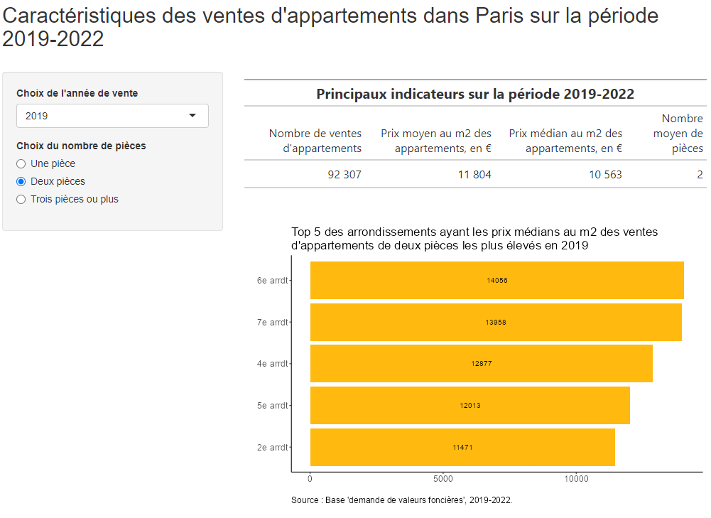
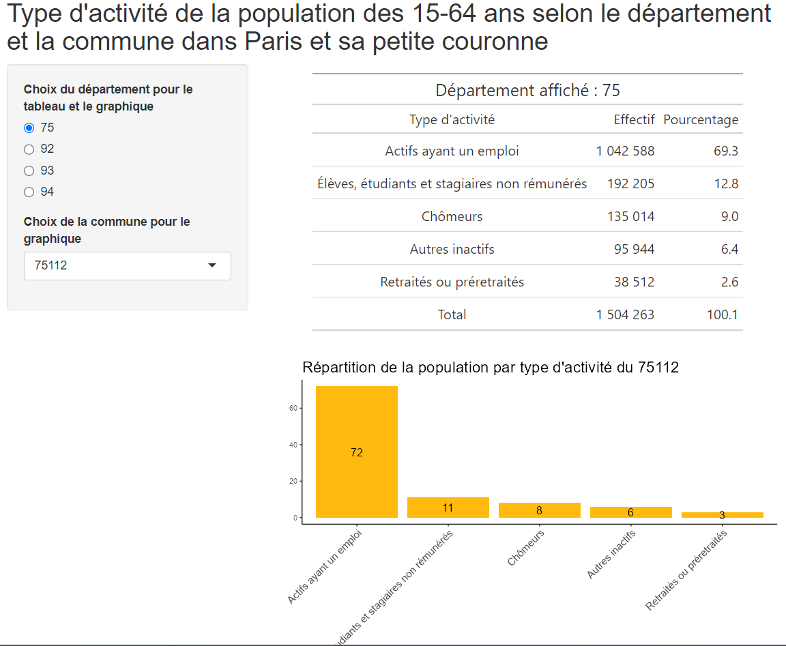

# La création d'une application Shiny "pas à pas" avec l'une de nos bases de données{#c10-Intro-a-Shiny-exemples}
<div align="justify">
On va utiliser la base du RP sur laquelle nous travaillons depuis le début, mais en créant des tableaux de contingence à partir des fonctions sauvegardées dans la section précédente.


## Application vide
Faisons tourner une application vide et ajoutons au fur et à mesure les éléments qui permettrons de construire une vraie application : 
```{r eval=FALSE}
library(shiny)

ui <- fluidPage(
                )

server <- function(input, 
                   output) {
  
                   }

shinyApp(ui = ui, server = server)
```

```{r eval=FALSE, include=FALSE, message=FALSE}
library(tidyverse)
library(janitor)
library(gt)
RP_final <- readRDS(file = "data/RP_final.Rdata")
```


## Ajout d'un titre et d'un widget
Ajoutons un titre et un widget, par exemple une barre "slider" : 
```{r eval=FALSE}
#library(shiny)

# Définition UI et Server de l'application Shiny
ui <- fluidPage(
  # Titre de l'application
  titlePanel("Nombre de propriétaires agrégé au niveau communal dans Paris et sa petite couronne"),
  
  # Définition du Widget - ici un slider en vue de construire un histogramme
  sidebarLayout(
    sidebarPanel(
      sliderInput(inputId = "Classes",
                  label = "Nombres de classes : ",
                  min = 1,
                  max = 50,
                  value = 25)
      ),
    
  mainPanel(
    plotOutput("histPlot")
    
    )
  )
)

server <- function(input, output) {
  
}

shinyApp(ui = ui, server = server)
```
  

## Ajout d'un graphique
Ajoutons un graphique ; il faut pour cela charger la base de données sur laquelle nous allons travailler ; pour l'exemple ici, nous allons créer un tableau de contingence à partir des fonctions créées précédemment (qu'on appelle donc avant) et donnant le nombre de propriétaires par commune de l'Île-de-France, en considérant les arrondissements de Paris comme des communes : 
```{r}
# appel fonctions enregistrées
source("fonctions/fonctions.R")

# création de la table de données
tab_proprio_com <- RP_final %>% filter(STOCD == "10") %>% 
                                      somme(var_gpe=COM, nom_var=STOCD) %>% 
                                      rename(nb_proprio = '10') %>% 
                                      filter(COM!="ZZZZZ")
```


```{r eval=FALSE}
#library(shiny)


# Définition UI et Server de l'application Shiny
ui <- fluidPage(
  # Titre de l'application
  titlePanel("Nombre de propriétaires agrégé au niveau communal dans Paris et sa petite couronne"),
  
  # Définition du Widget - ici un slider en vue de construire un histogramme
    sidebarLayout(
        sidebarPanel(
            sliderInput(inputId = "classes",
                        label = "Nombres de classes",
                        min = 1,
                        max = 50,
                        value = 25)
        ),

        # Graphe montré à l'utilisateur
        mainPanel(
           plotOutput("histPlot")
        )
  )
)

server <- function(input, 
                   output) {
output$histPlot <- renderPlot({
  tab_proprio_com %>%  
    ggplot() + aes(x=nb_proprio) + geom_histogram(bins=25)
})

  }

shinyApp(ui = ui, server = server)
```
  

On a bien maintenant le graphique qui s'affiche mais lorsqu'on change le nombre de classes dans la barre slider, rien ne se passe... C'est normal, nous n'avons pas encore introduit de réactivité dans l'application.  

Pour cela, il va falloir modifier le code dans la fonction **`server`** et ainsi mettre en lien des informations indiquées dans la fonction **`UI`** avec les arguments utilisés dans le graphique développé dans la fonction **`server`**. Pour l'instant, on veut pouvoir modifier le nombre de classes, l'argument pour cela dans la fonction `geom_histogram()` dans le `ggplot()` est `bins=` ; on a indiqué '50' jusqu'ici ; maintenant il faut lui indiquer le nombre que l'utilisateur va lui-même indiquer dans la barre slider ; cela se fait avec l'argument `input$...`, les "..." devant être remplacés par le nom que l'on a donné à l'`inputId` dans le `sliderInput()`, donc ici "classes".
```{r eval=FALSE}

# Définition UI et Server de l'application Shiny
ui <- fluidPage(
  # Titre de l'application
  titlePanel("Nombre de propriétaires agrégé au niveau communal dans Paris et sa petite couronne"),
  
  # Définition du Widget - ici un slider en vue de construire un histogramme
  sidebarLayout(
    sidebarPanel(
      sliderInput(inputId = "classes",
                  label = "Nombres de classes",
                  min = 1,
                  max = 50,
                  value = 25)
    ),
    
    # Graphe montré à l'utilisateur
    mainPanel(
      plotOutput("histPlot")
    )
  )
)

  server <- function(input, output) {
  
    output$histPlot <- renderPlot({
      tab_proprio_com %>%  
        ggplot() + aes(x=nb_proprio) + geom_histogram(bins=input$classes)
    })
    
  }
  
shinyApp(ui = ui, server = server)
```
   

Ça y est, maintenant lorsqu'on modifie le curseur dans la barre slider, le graphique change !
  

## Modification du graphique : filtrer selon une variable
Essayons ensuite d'ajouter un filtre sur le département pour n'avoir que la distribution du nombre de propriétaires pour un département donné.  Comme on n'a pas de variable de département, il faut la créer, ce que l'on peut faire assez facilement à partir des deux premiers chiffres de la commune, et ensuite il suffit d'ajouter un filtre sur cette nouvelle variable créée.   

De même, on peut procéder par étapes : présentons d'abord le graphique pour le seul département de l'Île-de-France (75).
```{r eval=FALSE}

# Création de la variable et donc remplacement de la table de données
tab_proprio_com <- tab_proprio_com %>%
  mutate(DEPT=as.factor(substr(COM, 1,2)))

# Définition UI et Server de l'application Shiny
ui <- fluidPage(
  # Titre de l'application
  titlePanel("Nombre de propriétaires agrégé au niveau communal dans Paris et sa petite couronne"),
  
  # Définition du Widget - ici un slider en vue de construire un histogramme
  sidebarLayout(
    sidebarPanel(
      sliderInput(inputId = "classes",
                  label = "Nombres de classes",
                  min = 1,
                  max = 50,
                  value = 25)
    ),
    
    # Graphe montré à l'utilisateur
    mainPanel(
      plotOutput("histPlot")
    )
  )
)

  server <- function(input, output) {
  
    output$histPlot <- renderPlot({
      tab_proprio_com %>%  
        filter(DEPT == "75") %>% 
        ggplot() + aes(x=nb_proprio) + geom_histogram(bins=input$classes)
    })
    
  }
  
shinyApp(ui = ui, server = server)
```
   

Ensuite, donnons la possibilité à l'utilisateur de choisir le département qu'il veut : il faut pour cela ajouter un widget dans la fonction **`UI`** ; comme on ne veut laisser qu'un choix de département à l'utilisateur, on peut utiliser un "Radio buttons" ; on regarde alors quels sont les arguments de la fonction `radioButtons()`, on  voit qu'il faut indiquer les choix possibles donc ici la liste des départements dans `choices = ` et indiquer une valeur par défaut dans `selected = ` ; pour cela, on peut indiquer la variable correspondante `choices = tab_proprio$DEPT`, mais attention si on laisse comme ceci, on va avoir une répétition de noms des départements comme lorsqu'on ouvre la table, ce qu'on veut c'est uniquement les niveaux... deux possibilités alors : soit créer avant l'appel de la fonction **`UI`** une variable avec simplement les niveaux de cette variable ; soit passer par la fonction `unique()` dans l'argument donné. 
```{r eval=FALSE}

# Définition UI et Server de l'application Shiny
ui <- fluidPage(
  # Titre de l'application
  titlePanel("Nombre de propriétaires agrégé au niveau communal dans Paris et sa petite couronne"),
  
  # Définition du Widget - ici un slider en vue de construire un histogramme
  sidebarLayout(
    sidebarPanel(
      sliderInput(inputId = "classes",
                  label = "Nombres de classes",
                  min = 1,
                  max = 50,
                  value = 25),
      radioButtons(inputId = "dept", 
                   label = "Choix du département",
                   choices = levels(tab_proprio_com$DEPT), #ou indiquer unique(tab_proprio_com$DEPT)
                   selected = "75"),
    ),
    
    # Graphe montré à l'utilisateur
    mainPanel(
      plotOutput("histPlot")
    )
  )
)

  server <- function(input, output) {
  
    output$histPlot <- renderPlot({
      tab_proprio_com %>%  
        filter(DEPT == "75") %>% 
        ggplot() + aes(x=nb_proprio) + geom_histogram(bins=input$classes)
    })
    
  }
  
shinyApp(ui = ui, server = server)
```
  
   
Enfin, là encore, il faut introduire la réactivité et "connecter" la partie **`UI`** et la partie **`server`**, en remplaçant le nom du département dans le `filter(dept == )` par le nom de l'`inputId` indiqué dans notre "radioButtons" : 
```{r eval=FALSE}

# Définition UI et Server de l'application Shiny
ui <- fluidPage(
  # Titre de l'application
  titlePanel("Nombre de propriétaires agrégé au niveau communal dans Paris et sa petite couronne"),
  
  # Définition du Widget - ici un slider en vue de construire un histogramme
  sidebarLayout(
    sidebarPanel(
      sliderInput(inputId = "classes",
                  label = "Nombres de classes",
                  min = 1,
                  max = 50,
                  value = 25),
      radioButtons(inputId = "dept", 
                   label = "Choix du département",
                   choices = levels(tab_proprio_com$DEPT), #ou indiquer unique(tab_proprio_com$DEPT)
                   selected = "75"),
    ),
    
    # Graphe montré à l'utilisateur
    mainPanel(
      plotOutput("histPlot")
    )
  )
)

  server <- function(input, output) {
  
    output$histPlot <- renderPlot({
      tab_proprio_com %>%  
        filter(DEPT == input$dept) %>% 
        ggplot() + aes(x=nb_proprio) + geom_histogram(bins=input$classes)
    })
    
  }
  
shinyApp(ui = ui, server = server)
```

On peut voir que le nombre de classes maximum de 50 n'est absolument pas pertinent pour certains départements qui ont peu de communes, c'est quelque chose qui pourra être modifiée bien sûr ultérieurement.  
  
  

## Modification du graphique : selon une variable au choix parmi deux
On peut maintenant vouloir montrer un graphique (toujours le même histogramme) selon au choix deux variables : soit le nombre de propriétaires, soit le nombre de locataires. Il faut donc créer cette dernière variable de la même façon que précédemment pour les propriétaires, et l'ajouter au tableau précédent (qu'on renommera puisqu'il ne concerne plus les seuls propriétaires...). 

```{r}
tab_locataires_com <- RP_final %>% 
              filter(STOCD %in% c("21","22","23")) %>% 
              mutate(STOCD=case_when(STOCD %in% c("21","22","23") ~ "nb_locataires")) %>% 
              somme(var_gpe=COM, nom_var=STOCD) %>% 
              filter(COM!="ZZZZZ")

tab_st_occ <- tab_proprio_com %>% 
  left_join(tab_locataires_com, by=join_by("COM"))

# pour supprimer les tables intermédiaires
rm(tab_locataires_com, tab_proprio_com)
```


Procédons comme précédemment : créons un nouveau widget avec par exemple `selectInput()`, dont l'`inputID` sera "variable" et l'argument `choices = ` donne les deux variables choisies ; pour cela, on peut utiliser une fonction `list()` et indiquer le nom des deux variables, soient `nb_proprio` et `nb_locataires`.  
Et ensuite, dans la fonction **server**, remplaçons `x=nb_proprio` par `x=input$variable` et voyons si cela marche !  

```{r eval=FALSE}

# Définition UI et Server de l'application Shiny
ui <- fluidPage(
  # Titre de l'application
  titlePanel("Statut d'occupation des logements agrégé au niveau communal, selon le département"),
  
  # Définition du Widget - ici un slider en vue de construire un histogramme
  sidebarLayout(
    sidebarPanel(
      sliderInput(inputId = "classes",
                  label = "Nombres de classes",
                  min = 1,
                  max = 50,
                  value = 25),
      radioButtons(inputId = "dept", 
                   label = "Choix du département",
                   choices = levels(tab_st_occ$DEPT),
                   selected = "75"),
      selectInput(inputId = "variable", 
                  label = "Choix de la variable", 
                  choices = list("nb_proprio", "nb_locataires"), 
                  selected = "nb_proprio"),
    ),
    
    # Graphe montré à l'utilisateur
    mainPanel(
      plotOutput("histPlot")
    )
  )
)

  server <- function(input, output) {
  
    output$histPlot <- renderPlot({
      tab_st_occ %>%  
        filter(DEPT == input$dept) %>% 
        ggplot() + aes(x=input$variable) + 
                   geom_histogram(bins=input$classes)
    })
    
  }
  
shinyApp(ui = ui, server = server)
```

Et non cela ne fonctionne pas. En réalité, comme nous avons utilisé dans `choices = ` une fonction `list()` qui fait appel à des variables de type caractère, la fonction `ggplot() + aes(x = )` ne comprend pas que la variable appelée est bien une variable numérique (son contenu), elle croît en quelque sorte que c'est une variable caractère. Il faut donc dire à la fonction `ggplot()` ici que le nom de la variable est de type "string" mais qu'elle comporte bien des valeurs numériques donc compatible avec un histogramme : pour cela, au lieu de `ggplot() + aes(x = )`, il faut utiliser `ggplot() + aes_string(x = )`.  

Réessayons : 
```{r eval=FALSE}

# Définition UI et Server de l'application Shiny
ui <- fluidPage(
  # Titre de l'application
  titlePanel("Statut d'occupation des logements agrégé au niveau communal, selon le département"),
  
  # Définition du Widget - ici un slider en vue de construire un histogramme
  sidebarLayout(
    sidebarPanel(
      sliderInput(inputId = "classes",
                  label = "Nombres de classes",
                  min = 1,
                  max = 50,
                  value = 25),
      radioButtons(inputId = "dept", 
                   label = "Choix du département",
                   choices = unique(tab_st_occ$DEPT),
                   selected = "75"),
      selectInput(inputId = "variable", 
                  label = "Choix de la variable", 
                  choices = list("nb_proprio", "nb_locataires"), 
                  selected = "nb_proprio"),
    ),
    
    # Graphe montré à l'utilisateur
    mainPanel(
      plotOutput("histPlot")
    )
  )
)

  server <- function(input, output) {
  
    output$histPlot <- renderPlot({
      tab_st_occ %>%  
        filter(DEPT == input$dept) %>% 
        ggplot() + aes_string(x=input$variable) + 
                   geom_histogram(bins=input$classes)
    })
    
  }
  
shinyApp(ui = ui, server = server)
```
  
  
  
Enfin, on peut ajouter en-dessous de l'histogramme un autre graphique, en l'occurence une boîte à moustache, et introduire une réactivité sur la base de données, ce qui permet un gain d'efficacité (en particulier en cas de base de données volumineuse) et ici d'éviter de réécrire deux fois le filtre dans les deux fonctions créant les deux graphiques : 
```{r eval=FALSE}

# Définition UI et Server de l'application Shiny
ui <- fluidPage(
  # Titre de l'application
  titlePanel("Statut d'occupation des logements au niveau communal, selon le département"),
  
  # Définition du Widget - ici un slider en vue de construire un histogramme
  sidebarLayout(
    sidebarPanel(
      sliderInput(inputId = "classes",
                  label = "Nombres de classes pour l'histogramme",
                  min = 1,
                  max = 50,
                  value = 25),
      radioButtons(inputId = "dept", 
                   label = "Choix du département",
                   choices = unique(tab_st_occ$DEPT), #ou indiquer 'nom_dept'
                   selected = "75"),
      selectInput(inputId = "variable", 
                  label = "Choix de la variable", 
                  choices = list("nb_proprio", "nb_locataires"), 
                  selected = "nb_proprio"),
    ),
    
    # Graphe montré à l'utilisateur
    mainPanel(
      plotOutput("histPlot"),
      plotOutput("boxPlot")
    )
  )
)

  server <- function(input, output) {
    
    # Base réactive
    tab_st_occ_react <- reactive({
      tab_st_occ %>%  
      filter(DEPT == input$dept)
    })
    
    output$histPlot <- renderPlot({
      tab_st_occ_react() %>% 
        ggplot() + aes_string(x=input$variable) + geom_histogram(bins=input$classes)
      
    })
    
    output$boxPlot <- renderPlot({
      tab_st_occ_react() %>%  
        ggplot() + aes_string(y = input$variable) + 
        geom_boxplot() + coord_flip() +
        scale_y_continuous(limits=c(0,quantile(tab_st_occ_react()[[input$variable]], 0.75)*2)) +
        labs(caption="Rq : les valeurs supérieures à 2 fois le Q3 de la distribution ne sont pas affichées sur le graphique", x="", y="") +
        theme(plot.caption = element_text(hjust=0, size=11.5))
    })
    
  }
  
shinyApp(ui = ui, server = server)
```
   

   

# Applications plus poussées sur Shiny

## Application avec un tableau et un graphique sur une autre base de données
En repartant de la base DVF des ventes d'appartements à Paris entre 2019 et 2022, on va créer une autre application en mettant en haut un tableau général récapitulant pour Paris et sur la période d'ensemble les informations suivantes : le prix moyen et médian au m2, le nombre moyen de pièces et le nombre de ventes ; puis en-dessous de ce tableau, on va ajouter un graphique (barplot) qui va représenter le "top 5" du prix médian au m2 des ventes d'appartements selon le nombre de pièces et selon l'arrondissement.  
Pour avoir des chiffres plus près de la réalité par rapport aux graphiques réalisées dans les sections précédentes sur cette base de données, on ne va prendre que les observations qui correspondent à une vente unique (`id_mutation` et `id_parcelle` différente pour chaque observation/ligne) ; on va utiliser pour cela la fonction `add_count()`.  
   
Ainsi, le premier tableau ne sera pas à ce stade réactif, alors que le graphique le sera. Il y aura par conséquent deux widgets, l'un pour choisir l'année considérée et l'autre pour choisir le nombre de pièces des logements.
Pour le tableau, vous pouvez utiliser le package **`gt()`** et la fonction `gt_output()` pour l'appel du tableau dans la partie **UI** associée à la fonction `render_gt()` dans la partie **server**.  
  
Cela doit vous donner ceci :


```{r eval=FALSE}
# Chargement des librairies
library(shiny)
library(tidyverse)
library(gt)
library(RColorBrewer)
library(forcats)


# Chargement du fichier
dvf_Paris_1 <- readRDS("data/dvf_Paris_1.Rdata")

# Création de la variable catégories de nombre de pièces et mise en factor de la variable du nom d'arrondissement
dvf_Paris_1 <- dvf_Paris_1 %>% filter(nom_arrdt != "NA") %>% 
                 mutate(nbpieces_cat=as.factor(case_when(nombre_pieces_principales==1 ~ 'Une pièce', 
                                                         nombre_pieces_principales==2 ~ 'Deux pièces',
                                                         nombre_pieces_principales>=3 ~ 'Trois pièces ou plus')),
                        nbpieces_cat=factor(nbpieces_cat, levels=c('Une pièce', 'Deux pièces', 'Trois pièces ou plus')),
                        annee=as.factor(annee)) %>% 
  add_count(id_mutation, id_parcelle, annee, surface_reelle_bati)


# Définition UI et Server de l'application Shiny
ui <- fluidPage(
  # Titre de l'application
  titlePanel("Caractéristiques des ventes d'appartements dans Paris sur la période 2019-2022"),
  
  br(),
  
  # Définition du Widget
  sidebarLayout(
    sidebarPanel(
      selectInput(inputId = "annee", 
                  label = "Choix de l'année de vente", 
                  choices = list("2019", "2020", "2021","2022"),
                  selected = "2019"),
      radioButtons(inputId = "nb_pieces", 
                   label = "Choix du nombre de pièces",
                   choices = levels(dvf_Paris_1$nbpieces_cat),
                   selected = "Deux pièces")

      ),
    
    # Tableau et graphe montré à l'utilisateur
    mainPanel(
      gt_output("tab"),

      br(),
      br(),
      
      plotOutput("barplot")    
    )
  )
)


server <- function(input, output) {
  
  output$tab <- render_gt({
    dvf_Paris_1 %>% 
      filter(n==1) %>% 
      summarise("Nombre de ventes d'appartements" = sum(nombre_lots),
                "Prix moyen au m2 des appartements, en €" = round(mean(px_m2)),
                "Prix médian au m2 des appartements, en €" = round(median(px_m2)),
                "Nombre moyen de pièces" = round(mean(nombre_pieces_principales))) %>% 
      gt() %>%  
      fmt_number(columns= 1:3, sep_mark = " ", decimals = 0) %>% 
      tab_header(title=md('**Principaux indicateurs sur la période 2019-2022**'))
  })


  output$barplot <- renderPlot({
  dvf_Paris_1 %>% 
      filter(annee == input$annee & nbpieces_cat==input$nb_pieces & n==1) %>% 
      group_by(nom_arrdt) %>% 
      summarise(med_prixm2 = round(median(px_m2))) %>% 
      arrange(desc(med_prixm2)) %>% slice(1:5) %>% 
      ggplot() + aes(x = med_prixm2, y = fct_reorder(nom_arrdt, med_prixm2))  + 
      geom_bar(stat="identity", fill="darkgoldenrod1")  +
      geom_text(aes(label=med_prixm2), position = position_stack(vjust=0.5), size=3.8) +
      labs(title = paste("Top 5 des arrondissements ayant les prix médians au m2 des ventes \nd'appartements", 
                         ifelse(input$nb_pieces=="Une pièce", "d'une pièce", 
                              ifelse(input$nb_pieces=="Deux pièces", "de deux pièces",
                                     ifelse(input$nb_pieces=="Trois pièces ou plus", "de trois pièces ou plus"))),
                         "les plus élevés en", input$annee),
           x=" ", y=" ",
           caption = "Source : Base 'demande de valeurs foncières', 2019-2022.") +
      theme_classic() +
      theme(plot.title = element_text(size=17),
            plot.caption = element_text(hjust = 0, size=12),
            axis.text.y = element_text(size=12.5),
            axis.text.x = element_text(size=12.5))
    
  })
  
}


shinyApp(ui = ui, server = server)
```

Par rapport aux exemples précédents déjà réalisés sur Shiny, nous n'avons pas beaucoup ajouté de choses nouvelles : un peu de langage html (`br()`) pour insérer des espaces entre le tableau et le graphique, ou le titre général et le reste des éléments de l'application ; puis une fonction de condition à l'intérieur du `labs()` de **`Ggplot`** et avec la fonction `paste()` pour, d'une part, que le titre change selon le nombre de pièces choisi par l'utilisateur (plusieurs fonctions `ifelse()`), et, d'autre part, que le titre change selon l'année choisie).    

   
On va maintenant rendre le tableau réactif selon l'année choisie.  
```{r eval=FALSE}
# Définition UI et Server de l'application Shiny
ui <- fluidPage(
  # Titre de l'application
  titlePanel("Caractéristiques des ventes d'appartements dans Paris sur la période 2019-2022"),
  
  br(),
  
  # Définition du Widget
  sidebarLayout(
    sidebarPanel(
      selectInput(inputId = "annee", 
                  label = "Choix de l'année de vente pour le tableau et le graphique", 
                  choices = list("2019", "2020", "2021","2022"),
                  selected = "2019"),
      radioButtons(inputId = "nb_pieces", 
                   label = "Choix du nombre de pièces pour le graphique",
                   choices = levels(dvf_Paris_1$nbpieces_cat),
                   selected = "Deux pièces")

      ),
    
    # Tableau et graphe montré à l'utilisateur
    mainPanel(
      gt_output("tab"),

      br(),
      br(),
      
      plotOutput("barplot")    
    )
  )
)


server <- function(input, output) {

  output$tab <- render_gt({
    dvf_Paris_1 %>% 
      filter(n==1 & annee == input$annee) %>% 
      summarise("Nombre de ventes d'appartements" = sum(nombre_lots),
                "Prix moyen au m2 des appartements, en €" = round(mean(px_m2)),
                "Prix médian au m2 des appartements, en €" = round(median(px_m2)),
                "Nombre moyen de pièces" = round(mean(nombre_pieces_principales))) %>% 
      gt() %>%  
      fmt_number(columns= 1:3, sep_mark = " ", decimals = 0) %>% 
      tab_header(title=paste('Principaux indicateurs en', input$annee))
  })


  output$barplot <- renderPlot({
      dvf_Paris_1 %>% 
      filter(annee == input$annee & nbpieces_cat==input$nb_pieces & n==1) %>% 
      group_by(nom_arrdt) %>%  
      summarise(med_prixm2 = round(median(px_m2))) %>% 
      arrange(desc(med_prixm2)) %>% slice(1:5)
      ggplot() + aes(x = med_prixm2, y = fct_reorder(nom_arrdt, med_prixm2))  + 
      geom_bar(stat="identity", fill="darkgoldenrod1")  +
      geom_text(aes(label=med_prixm2), position = position_stack(vjust=0.5), size=3.8) +
      labs(title = paste("Top 5 des arrondissements ayant les prix médians au m2 des ventes \nd'appartements", 
                         ifelse(input$nb_pieces=="Une pièce", "d'une pièce", 
                              ifelse(input$nb_pieces=="Deux pièces", "de deux pièces",
                                     ifelse(input$nb_pieces=="Trois pièces ou plus", "de trois pièces ou plus"))),
                         "les plus élevés en", input$annee),
           x=" ", y=" ",
           caption = "Source : Base 'demande de valeurs foncières', 2019-2022.") +
      theme_classic() +
      theme(plot.title = element_text(size=17),
            plot.caption = element_text(hjust = 0, size=12),
            axis.text.y = element_text(size=12.5),
            axis.text.x = element_text(size=12.5))
    
  })
  
}


shinyApp(ui = ui, server = server)
```


## Introduction d'une réactivité appliquée à la table de données
On peut rendre maintenant la base de données réactive avec la fonction `reactive({})`. On l'avait vu, la fonction `reactive()` permet de créer un objet réactif qui est à la fois une entrée réactive et une sortie réactive, l’objet va donc se mettre à jour automatiquement si les entrées qu’il utilise changent, et il va automatiquement déclencher la mise à jour des sorties où il est utilisé.  
La fonction permet techniquement de décomposer du code réactif et est utile lorsque certaines parties du code sont utilisées par plusieurs outputs car elle va permettre alors d'éviter des redondances. Cela peut être le cas lorsqu'on doit filtrer et/ou sélectionner des mêmes variables en input pour plusieurs outputs.  
Ici, on va décomposer la partie 'data' du code précédent de la partie construction du graphique ; le rendu sera strictement le même ; mais cela peut être plus efficace en cas de long code et d'application complexe car en gros on va exécuter qu'une seule fois l'opération 'data' réalisée ici.  
Attention, la base réactive créée est une fonction, il faut donc l'appeler avec des parenthèses !

```{r eval=FALSE}
# Définition UI et Server de l'application Shiny
ui <- fluidPage(
  # Titre de l'application
  titlePanel("Caractéristiques des ventes d'appartements dans Paris sur la période 2019-2022"),
  
  br(),
  
  # Définition du Widget
  sidebarLayout(
    sidebarPanel(
      selectInput(inputId = "annee", 
                  label = "Choix de l'année de vente pour le tableau et le graphique", 
                  choices = list("2019", "2020", "2021","2022"),
                  selected = "2019"),
      radioButtons(inputId = "nb_pieces", 
                   label = "Choix du nombre de pièces pour le graphique",
                   choices = levels(dvf_Paris_1$nbpieces_cat),
                   selected = "Deux pièces")

      ),
    
    # Tableau et graphe montré à l'utilisateur
    mainPanel(
      gt_output("tab"),

      br(),
      br(),
      
      plotOutput("barplot")    
    )
  )
)


server <- function(input, output) {
  
  output$tab <- render_gt({
    dvf_Paris_1 %>% 
      filter(nombre_lots=="1" & annee == input$annee) %>% 
      summarise("Nombre de ventes d'appartements" = sum(nombre_lots),
                "Prix moyen au m2 des appartements, en €" = round(mean(px_m2)),
                "Prix médian au m2 des appartements, en €" = round(median(px_m2)),
                "Nombre moyen de pièces" = round(mean(nombre_pieces_principales))) %>% 
      gt() %>%  
      fmt_number(columns= 1:3, sep_mark = " ", decimals = 0) %>% 
      tab_header(title=md('**Principaux indicateurs sur la période 2019-2022**'))
  })

  
  dvf_Paris_react <- reactive({
    dvf_Paris_1 %>% 
      filter(annee == input$annee & nbpieces_cat==input$nb_pieces & annee == input$annee) %>% 
      group_by(nom_arrdt) %>%  
      summarise(med_prixm2 = round(median(px_m2))) %>% 
      arrange(desc(med_prixm2)) %>% slice(1:5)
  })

  output$barplot <- renderPlot({
  dvf_Paris_react() %>% 
      ggplot() + aes(x = med_prixm2, y = fct_reorder(nom_arrdt, med_prixm2))  + 
      geom_bar(stat="identity", fill="darkgoldenrod1")  +
      geom_text(aes(label=med_prixm2), position = position_stack(vjust=0.5), size=3.8) +
      labs(title = paste("Top 5 des arrondissements ayant les prix médians au m2 des ventes \nd'appartements", 
                         ifelse(input$nb_pieces=="Une pièce", "d'une pièce", 
                              ifelse(input$nb_pieces=="Deux pièces", "de deux pièces",
                                     ifelse(input$nb_pieces=="Trois pièces ou plus", "de trois pièces ou plus"))),
                         "les plus élevés en", input$annee),
           x=" ", y=" ",
           caption = "Source : Base 'demande de valeurs foncières', 2019-2022.") +
      theme_classic() +
      theme(plot.title = element_text(size=17),
            plot.caption = element_text(hjust = 0, size=12),
            axis.text.y = element_text(size=12.5),
            axis.text.x = element_text(size=12.5))
    
  })
  
}


shinyApp(ui = ui, server = server)
```
   


## Introduction d'une réactivité sur les inputs (contexte réactif)
On va maintenant introduire un contexte réactif.   
Pour cela, on va repartir de la base du RP, puisqu'on peut y distinguer les départements et les communes, en s'intéressant à la répartition de la population de 15-64 ans selon le type d'activité, et donc par département et commune. On va de façon comparable à ce qu'on a fait précédemment, créer en haut un tableau qui donnera cette répartition pour le département ; puis en-dessous un graphique qui montrera cette répartition pour une des communes de ce département. 
On aura donc deux widgets, un pour le choix du département et un pour le choix de la commune. On veut que lorsqu'on choisit Paris en département par exemple, le widget de la commune ne nous montre que les arrondissements de Paris (et non toutes les communes des 4 départements de notre champ), etc.   

On peut pour cela utiliser la fonction `observe()` : on l'utilise donc quand un input change.  
Il va falloir ici utiliser à l'intérieur de la fonction `observe()` une condition `if ... else ...` : on part du principe qu'on affiche d'abord automatiquement le département "75", lorsque l'utilisateur appuie sur le bouton du choix de département du  widget `radioButtons`, le widget `selectInput` doit être actualisé en permettant les seuls choix de communes de Paris donc les arrondissements ; de même pour les autres départements.   

Il faut donc utiliser la fonction `observe()`, une condition `if ... else ...` et une actualisation des widgets avec la fonction `updateSelectInput()`.  

L'image suivante vous donne un aperçu de ce qu'on devrait avoir pour Paris : 


```{r eval=FALSE}
# Définition UI et Server de l'application Shiny
ui <- fluidPage(
  # Titre de l'application
  titlePanel("Type d'activité de la population des 15-64 ans selon le département et la commune dans Paris et sa petite couronne"),
  
  # Définition du Widget
  sidebarLayout(
    sidebarPanel(
      radioButtons(inputId = "dept", 
                   label = "Choix du département pour le tableau et le graphique",
                   choices = unique(RP_final$DEPT),
                   selected = "75"),
      selectInput(inputId = "commune", 
                  label = "Choix de la commune pour le graphique", 
                  choices = unique(RP_final$COM),
                  selected = "75112")
      ),
    
    # Tableau et graphe montré à l'utilisateur
    mainPanel(
      gt_output("tab"),
      
      br(),
      
      plotOutput("barplot")    
    )
  )
)


server <- function(input, output) {
  
  RP_final_react <- reactive({
    RP_final %>% 
      filter(AGEREV>=15 & AGEREV<=64 & DEPT==input$dept) %>%  
      mutate(TACT_moda1=as.factor(case_when(TACT == "11" ~ "Actifs ayant un emploi",
                                            TACT == "12" ~ "Chômeurs",
                                            TACT == "22" ~ "Élèves, étudiants et stagiaires non rémunérés",
                                            TACT == "21" ~ "Retraités ou préretraités",
                                            TRUE ~ "Autres inactifs")))
  })

    observe({
    input$dept
    if(input$dept == "75"){
      updateSelectInput(inputId = "commune",
                        choices = unique(RP_final[RP_final$DEPT=="75", ]$COM),
                        selected = "75112")
      }
    else {updateSelectInput(inputId = "commune",
                            choices = unique(RP_final[RP_final$DEPT==input$dept, ]$COM),
                            selected = input$variable)
    }
  })  

  output$tab <- render_gt({
    RP_final_react() %>% 
      count(TACT_moda1, wt=IPONDI) %>% 
      mutate(Pourcentage=round(prop.table(n)*100,1)) %>% 
      arrange(desc(Pourcentage)) %>% 
      adorn_totals("row") %>% 
      rename(Effectif=n, "Type d'activité"=TACT_moda1) %>% 
      gt() %>% 
      fmt_number(columns = 2, sep_mark = " ", decimals = 0) %>% 
      tab_header(title = paste("Département affiché :", input$dept))
  })


  output$barplot <- renderPlot({
    RP_final_react() %>% 
      filter(COM==input$commune) %>% 
      count(TACT_moda1, wt=IPONDI) %>% 
      mutate(Pourcentage=round(prop.table(n)*100,0)) %>% 
      select(-n) %>% 
      ggplot() + aes(x=fct_reorder(TACT_moda1, desc(Pourcentage)), y=Pourcentage) + 
      geom_bar(stat = "identity", fill="darkgoldenrod1") +
      geom_text(aes(label=Pourcentage), position = position_stack(vjust=0.5), size=4.7) +
      labs(title=paste("Répartition de la population en % par type d'activité du", input$commune),
           x = "", y = " ") +
      theme_classic() +
      theme(plot.title=element_text(size=18),
            axis.text.x = element_text(size=12, angle=45, hjust=1))
    
  })
  
}


shinyApp(ui = ui, server = server)
```
 

